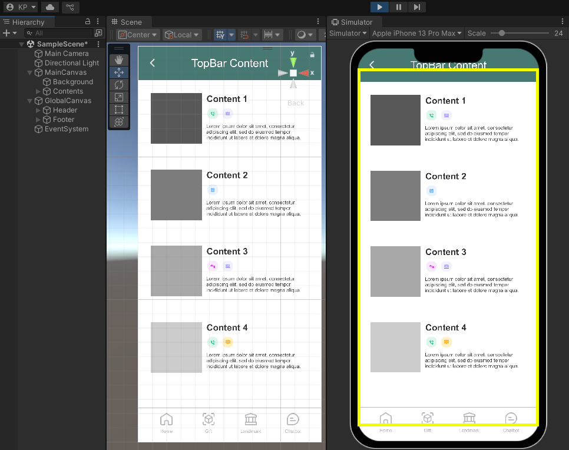
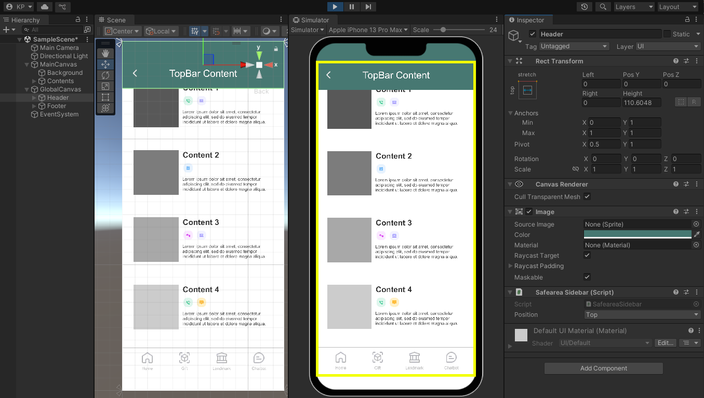

# Unity safearea sidebar

When developing mobile applications in Unity, the `com.unity.device-simulator.devices` package provides convenient layout guidelines for Unity engineers. However, it has limitations in addressing various gaps that occur between the device's **SafeArea** and **Unity UI**.

Among these numerous gaps, I particularly focused on finding an easier way to implement the device's **TopBar** and **BottomBar** (e.g., Bottomsheet). Through the materials in this repository, I'd like to share my approach with you.

# How to use

When working on UI in the canvas, situations often arise where you need to create a TopBar or BottomBar. 

In these cases, engineer must consider two issues:

1. Is the TopBar or BottomBar exposed outside the SafeArea?
2. Does the TopBar or BottomBar not fill the area outside of SafeArea?

The above image shows an implementation of TopBar and BottomBar without using any additional features.

Upon entering play mode, engineers will notice that the first issue mentioned above has occurred. If they try to resolve this by adjusting the Sidebar's Position or Height values, they'll likely run into the second issue

Ignoring these situations could lead to potential conflicts with device OS functionalities. 

Using `SafeareaSidebar` can easily resolve these problems.

`SafeareaSidebar` directly references the `SafeArea`, `Screen`, and the canvas's `ReferenceResolution` to dynamically adjust the SideBar and its contents.

> [!TIP]
> It is recommended to use this alongside open-source solutions that adjust content positioning within the Canvas using SafeArea.

## Libraries Used

| Name                               | License                                                                      |
|------------------------------------|------------------------------------------------------------------------------|
| com.unity.device-simulator.devices | [Unity license](https://unity.com/kr/legal/licenses/unity-companion-license) |

## License

This is available under the [MIT License](https://github.com/Kunnymann/safearea-sidebar/blob/main/LICENSE).
